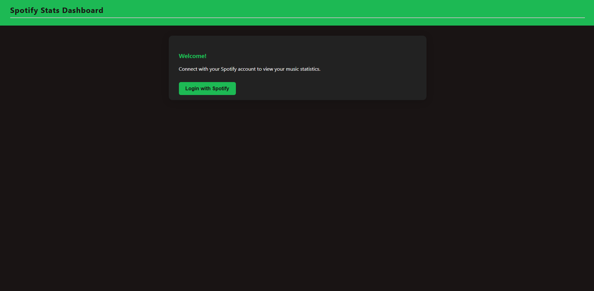

# SpotifyTrack

SpotifyTrack is a Flask web application that allows users to log in with their Spotify account and view personalized statistics such as their top tracks, top artists, and recently played songs. The app uses the Spotify Web API via Spotipy and securely manages authentication using OAuth2.

## Features

- Spotify OAuth2 login
- View your top tracks and artists
- See your recently played tracks
- Simple, extensible Flask blueprint structure

## Setup

### Prerequisites

- Python 3.8+
- [Spotify Developer Account](https://developer.spotify.com/dashboard/applications)
- [pip](https://pip.pypa.io/en/stable/)

### Installation

1. **Clone the repository:**
    ```sh
    git clone https://github.com/yourusername/spotifyTrack.git
    cd spotifyTrack
    ```

2. **Create and activate a virtual environment:**
    ```sh
    python -m venv venv
    venv\Scripts\activate  # On Windows
    # or
    source venv/bin/activate  # On macOS/Linux
    ```

3. **Install dependencies:**
    ```sh
    pip install -r requirements.txt
    ```

4. **Set up your `.env` file:**

    Create a `.env` file in the project root with the following content:
    ```
    FLASK_SECRET_KEY=your_flask_secret_key
    SPOTIFY_CLIENT_ID=your_spotify_client_id
    SPOTIFY_CLIENT_SECRET=your_spotify_client_secret
    SPOTIFY_REDIRECT_URI=http://127.0.0.1:5000/callback
    ```

    Make sure the redirect URI matches the one registered in your Spotify Developer Dashboard.

5. **Run the app:**
    ```sh
    python app.py
    ```

6. **Open your browser and go to:**
    ```
    http://127.0.0.1:5000/
    ```


## Project Structure

```
spotifyTrack/
│
├── app.py
├── requirements.txt
├── .env
├── .gitignore
├── README.md
└── userStats/
    ├── __init__.py
    ├── api/
    │   └── spotify_client.py
    └── routes/
        └── routes.py
```

## Notes

- Do **not** commit your `.env` file or any secrets to version control.
- If you encounter a redirect URI error, ensure the URI in your `.env` matches the one in your Spotify app settings.

## License

MIT License

---

*Built with Flask and Spotipy.*